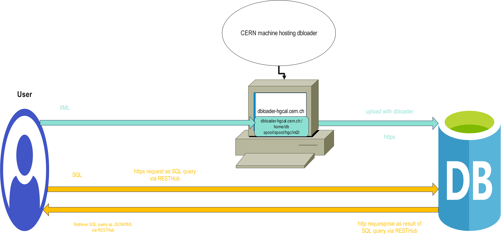
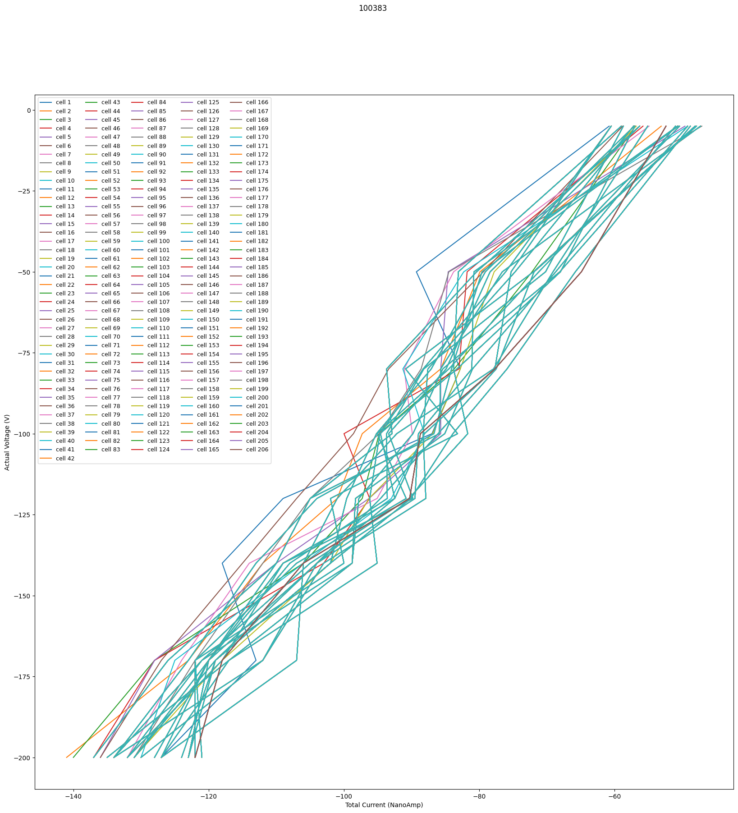

# Quick Tutorial on Python Interaction with the HGCAL INT2R database
## Ali Al Kadhim - FSU
## May 2023


```python
import cx_Oracle
import sys
import pandas as pd
import numpy as np
import matplotlib.pyplot as plt
import matplotlib.colors as mcolors
import argparse
import os
import IPython
from IPython.display import Image, display
import time
from ipywidgets import interact, interactive, fixed, interact_manual
import ipywidgets as widgets
# USE PYTHON3  !

os.environ['PASCAL']='/home/PASCAL_REPO'
```


```python
print(os.environ['PASCAL'])
PASCAL=os.environ['PASCAL']
OUTPUT_DIR=os.path.join(PASCAL,'outputs')
QUERY_DIR=os.path.join(PASCAL,'queries')
LOG_DIR=os.path.join(PASCAL,'logs')
IMAGE_DIR=os.path.join(PASCAL,'images')
```

    /home/PASCAL_REPO


Make sure you've run `bash tunnel.sh username` before starting this or in the same terminal that is running this notebook

- Show image(s)

- Each query is saved in a .sql file, and the function just opens and grabs these
- Query History/log. Maybe everytime you run "execute_query"
- Option to Save query if you like it, or put your own query in the queries directory as a .sql


```python
############################# Some helper functions ##############
# def printException(exception):
#       error, = exception.args
#   printf("Error code = %s\n",error.code)
#   printf("Error message = %s\n",error.message)

def printf(format,*args):
      sys.stdout.write(format % args)

def show_jupyter_image(image_filename, width=1300, height=300):
    """Show a saved image directly in jupyter. Make sure image_filename is in your IQN_BASE !"""
    display(Image(os.path.join(os.environ['PASCAL'], 'images', image_filename), width=width, height=height))

def makeDictFactory(cursor):
    columnNames = [d[0] for d in cursor.description]
    def createRow(*args):
        return dict(zip(columnNames, args))
    return createRow

def output_type_handler(cursor, name, default_type, size, precision, scale):
    if default_type == cx_Oracle.DB_TYPE_VARCHAR:
        return cursor.var(default_type, size, arraysize=cursor.arraysize,
                          encoding_errors="replace")

# cursor.outputtypehandler = output_type_handler


############################ Some decorators ############################
def SourcePASCAL(func):
    def _func(*args):
        import os
        from common.utility.source import source

        env = {}
        env.update(os.environ)
        env.update(source(os.environ["PASCAL"]))
        func(*args, env=env)

    return _func

def debug(func):
    """Print the function signature and return value"""
    import functools

    @functools.wraps(func)
    def wrapper_debug(*args, **kwargs):
        args_repr = [repr(a) for a in args]
        kwargs_repr = [f"{k}={v!r}" for k, v in kwargs.items()]
        signature = ", ".join(args_repr + kwargs_repr)
        print(f"Calling {func.__name__}({signature})")
        values = func(*args, **kwargs)
        print(f"{func.__name__!r} returned {values!r}")
        return values

    return wrapper_debug

def make_interactive(func):
    """make the plot interactive"""
    import functools

    @functools.wraps(func)
    def wrapper(*args, **kwargs):
        plt.ion()
        output = func(*args, **kwargs)
        plt.ioff()
        return output

    return wrapper

def timer(func):
    """Print the runtime of the decorated function"""
    import functools
    import time
    @functools.wraps(func)
    def wrapper_timer(*args, **kwargs):
        start_time = time.perf_counter()    # 1
        value = func(*args, **kwargs)
        end_time = time.perf_counter()      # 2
        run_time = end_time - start_time    # 3
        print(f"\nFINISHED {func.__name__!r} in {run_time:.4f} SECS")
        return value
    return wrapper_timer

# from IPython.core.magic import register_cell_magic

# @register_cell_magic
def write_and_run(line, cell):
    """write the current cell to a file (or append it with -a argument) as well as execute it
    use with %%write_and_run at the top of a given cell"""
    argz = line.split()
    file = argz[-1]
    mode = "w"
    if len(argz) == 2 and argz[0] == "-a":
        mode = "a"
    with open(file, mode) as f:
        f.write(cell)
    # get_ipython().run_cell(cell)
############################  ############################

```

### Screenshot of dbolader diagram


```python
display(Image(os.path.join(IMAGE_DIR, 'RESTHUB_dbloader_diagram.png')))
```


    

    


### Screenshot of `XML` template -> SQLDeveloper view

Previously, the recommended way to read data from HGCAL DB was using SQLDeveloper.

## Define Connection Configurations


The database is  a Oracle Database, with access permitted at port 10131. For Int2R, The service name, username, and passwork are 'int2r_lb.cern.ch', 'HGCAL_Reader_2016' and 'CMS_HGC_PRTTYPE_HGCAL_READER', respectively.


```python
HOST='localhost'
PORT = '10131'
SERVICE_NAME='int2r_lb.cern.ch'
PASS=r'HGCAL_Reader_2016'
USER=r'CMS_HGC_PRTTYPE_HGCAL_READER'
```

make TNS connection


```python
DSN_TNS = cx_Oracle.makedsn(HOST, PORT, service_name=SERVICE_NAME)
```

Create the connection only once for faster eqxecution


```python
try:
    conn = cx_Oracle.connect(user=USER, password=PASS, dsn=DSN_TNS, 
                       # encoding="UTF-8"
                       ) 
    print("\nGreat! You've successfully Connected to the Database\n")
except Exception:
    print("\nUnfortunately, you have not connected to the database. Do you have access permission from Umesh or Haffeez?\n")
```

    
    Great! You've successfully Connected to the Database
    


# Quick Tutorial on SQL queries in HGCAL INT2R

SQL for data-retrieval in a nutshell: `

Look at the Documentation [here](https://readthedocs.web.cern.ch/display/HGCLogic/HGCAL+DB+tables+-+documentation+for+assembly) for explanation of the schemas, tables and attributes. Since this is made from SQC-related tables perspective, we will be using the tables in the `CMS_HGC_CORE_COND` schema.


You should think of the `CMS_HGC_CORE_COND.COND_DATA_SETS` table as the master table that has a record of everything that was uploaded, and the `CONDITION_DATA_SET_ID` as the successful upload ID that relates schemas and tables.

### Part 1: Sample Queries to Get Started

We will Ue [cx_Oracle](https://cx-oracle.readthedocs.io/) for the interface with the DB, all the dependencies and configurations have been configured in the Pascal docker image

We will execute any SQL query (that permitted by [cx_Oracle](https://cx-oracle.readthedocs.io/) ), and return output as pandas DataFrame


### Example 1: Execute SQL Query Directly


```python
@timer
def execute_query(QUERY, maxrows ='all', outformat='DF', saveformat=None, outstring=None):
    """
    
    Args:
    outformat: the format of the result. DF = pandas.DataFrame(),
    """
    # conn = None
    try:
    # if you want a new connection and close it at the end, uncomment below
      conn = cx_Oracle.connect(user=USER, password=PASS, dsn=DSN_TNS, 
                               # encoding="UTF-8"
                               ) 


      cursor = conn.cursor()

    except Exception as err:
      print('Connection error')
      print(err)
    finally:
      if conn:
            if maxrows=='all':
            # execute
                cursor.execute(QUERY)
            # rows = cursor.execute(QUERY2)
            # cursor.execute(QUERY_TIME_3)
            # conn.commit()
            else:
                cursor.execute(QUERY,offset=0, maxnumrows=maxrows)
            
            # try:
              # rows=cursor.fetall()
            # except Exception as err:
              # print(err)
            columnNames = [d[0] for d in cursor.description]
            print('\nCOLUMN NAMES:\n', columnNames)
            # for row in rows:
                  # print(list(row))
            #return result as a dictionary
            result = [dict(zip(columnNames, row)) for row in cursor.fetchall()]
            # result=None
            cursor.close()
            conn.close()
    
    if outformat=='DF':
        df =pd.DataFrame(result)
    
    
    
    if saveformat=='CSV':
        df.to_csv(os.path.join(OUTPUT_DIR, f'{outstring}.csv'))
    # print(df.head())
    return df
```

---

The SQL query

`select * from CMS_HGC_CORE_COND.KINDS_OF_CONDITIONS;` 

translates to 

"show all columns and rows from the `KINDS_OF_CONDITIONS` table in the `CMS_HGC_CORE_COND` account"

---


```python
 execute_query(QUERY="select * from CMS_HGC_CORE_COND.KINDS_OF_CONDITIONS")
```

    
    COLUMN NAMES:
     ['KIND_OF_CONDITION_ID', 'IS_RECORD_DELETED', 'NAME', 'EXTENSION_TABLE_NAME', 'RECORD_INSERTION_TIME', 'RECORD_INSERTION_USER', 'RECORD_LASTUPDATE_TIME', 'RECORD_LASTUPDATE_USER', 'COMMENT_DESCRIPTION', 'CATEGORY_NAME']
    
    FINISHED 'execute_query' in 0.4820 SECS


<div>
<style scoped>
    .dataframe tbody tr th:only-of-type {
        vertical-align: middle;
    }

    .dataframe tbody tr th {
        vertical-align: top;
    }

    .dataframe thead th {
        text-align: right;
    }
</style>
<table border="1" class="dataframe">
  <thead>
    <tr style="text-align: right;">
      <th></th>
      <th>KIND_OF_CONDITION_ID</th>
      <th>IS_RECORD_DELETED</th>
      <th>NAME</th>
      <th>EXTENSION_TABLE_NAME</th>
      <th>RECORD_INSERTION_TIME</th>
      <th>RECORD_INSERTION_USER</th>
      <th>RECORD_LASTUPDATE_TIME</th>
      <th>RECORD_LASTUPDATE_USER</th>
      <th>COMMENT_DESCRIPTION</th>
      <th>CATEGORY_NAME</th>
    </tr>
  </thead>
  <tbody>
    <tr>
      <th>0</th>
      <td>2640</td>
      <td>F</td>
      <td>HGC Sensor Manufacturer IV Test</td>
      <td>HGC_SENSOR_IV</td>
      <td>2018-02-17 07:07:52</td>
      <td>Umesh</td>
      <td>2020-03-07 10:00:28</td>
      <td>CMS_HGC_CORE_COND</td>
      <td>HGC Sensor IV Test</td>
      <td>MEASUREMENT</td>
    </tr>
    <tr>
      <th>1</th>
      <td>1100</td>
      <td>F</td>
      <td>Hamamatsu-S10938-4956 Sensor IV Test</td>
      <td>TEST_SENSOR_IV</td>
      <td>2017-09-14 06:44:30</td>
      <td>Umesh</td>
      <td>2020-03-07 10:11:03</td>
      <td>CMS_HGC_CORE_COND</td>
      <td>Hamamatsu-S10938-4956 Sensor IV Test</td>
      <td>MEASUREMENT</td>
    </tr>
    <tr>
      <th>2</th>
      <td>1120</td>
      <td>F</td>
      <td>Hamamatsu-S10938-4956 Sensor CV Test</td>
      <td>TEST_SENSOR_CV</td>
      <td>2017-09-14 06:44:34</td>
      <td>Umesh</td>
      <td>2020-03-07 10:11:03</td>
      <td>CMS_HGC_CORE_COND</td>
      <td>Hamamatsu-S10938-4956 Sensor CV Test</td>
      <td>MEASUREMENT</td>
    </tr>
    <tr>
      <th>3</th>
      <td>1140</td>
      <td>F</td>
      <td>Hamamatsu-S10938-4956 Sensor Test Conds</td>
      <td>TEST_SENSOR_CONDITIONS</td>
      <td>2017-09-14 06:44:37</td>
      <td>Umesh</td>
      <td>2020-03-07 10:11:03</td>
      <td>CMS_HGC_CORE_COND</td>
      <td>Hamamatsu-S10938-4956 Sensor Test Conditions</td>
      <td>MEASUREMENT</td>
    </tr>
    <tr>
      <th>4</th>
      <td>18640</td>
      <td>F</td>
      <td>HGC Sensor Flatness Data</td>
      <td>FLATNS_SENSOR_DATA</td>
      <td>2022-10-10 12:18:42</td>
      <td>Umesh</td>
      <td>NaT</td>
      <td>None</td>
      <td>HGC Sensor Flatness Data</td>
      <td>None</td>
    </tr>
    <tr>
      <th>...</th>
      <td>...</td>
      <td>...</td>
      <td>...</td>
      <td>...</td>
      <td>...</td>
      <td>...</td>
      <td>...</td>
      <td>...</td>
      <td>...</td>
      <td>...</td>
    </tr>
    <tr>
      <th>82</th>
      <td>17080</td>
      <td>F</td>
      <td>SiPM HGCROC RAM Retention Time</td>
      <td>HGCROC_RAM_RETENTION</td>
      <td>2022-06-25 04:39:05</td>
      <td>Umesh</td>
      <td>NaT</td>
      <td>None</td>
      <td>SiPM HGCROC RAM Retention Time</td>
      <td>None</td>
    </tr>
    <tr>
      <th>83</th>
      <td>17100</td>
      <td>F</td>
      <td>HD HGCROC DACB Conveyor Test</td>
      <td>HGCROC_DACB_CONVEYOR_TEST</td>
      <td>2022-06-25 05:11:06</td>
      <td>Umesh</td>
      <td>2022-06-25 05:16:37</td>
      <td>CMS_HGC_CORE_COND</td>
      <td>HD HGCROC_DACB_Conveyor_TEST</td>
      <td>None</td>
    </tr>
    <tr>
      <th>84</th>
      <td>17120</td>
      <td>F</td>
      <td>LD HGCROC DACB Conveyor Test</td>
      <td>HGCROC_DACB_CONVEYOR_TEST</td>
      <td>2022-06-25 05:11:06</td>
      <td>Umesh</td>
      <td>2022-06-29 00:48:51</td>
      <td>CMS_HGC_CORE_COND</td>
      <td>LD HGCROC_DACB_Conveyor_TEST</td>
      <td>None</td>
    </tr>
    <tr>
      <th>85</th>
      <td>17140</td>
      <td>F</td>
      <td>SiPM HGCROC DACB Conveyor Test</td>
      <td>HGCROC_DACB_CONVEYOR_TEST</td>
      <td>2022-06-25 05:11:07</td>
      <td>Umesh</td>
      <td>2022-06-29 00:48:55</td>
      <td>CMS_HGC_CORE_COND</td>
      <td>SiPM HGCROC_DACB_Conveyor_TEST</td>
      <td>None</td>
    </tr>
    <tr>
      <th>86</th>
      <td>4220</td>
      <td>F</td>
      <td>HGC Six Inch Proto Module Assembly</td>
      <td>HGC_PRTO_MOD_ASMBLY</td>
      <td>2018-12-01 19:38:58</td>
      <td>Umesh</td>
      <td>2020-03-07 11:34:58</td>
      <td>CMS_HGC_CORE_COND</td>
      <td>HGC Six Inch Proto Module Assembly</td>
      <td>CONFIGURATION</td>
    </tr>
  </tbody>
</table>
<p>87 rows × 10 columns</p>
</div>


```python
 df=execute_query(QUERY="select * from CMS_HGC_CORE_COND.KINDS_OF_CONDITIONS")
 df.head()
```

    
    COLUMN NAMES:
     ['KIND_OF_CONDITION_ID', 'IS_RECORD_DELETED', 'NAME', 'EXTENSION_TABLE_NAME', 'RECORD_INSERTION_TIME', 'RECORD_INSERTION_USER', 'RECORD_LASTUPDATE_TIME', 'RECORD_LASTUPDATE_USER', 'COMMENT_DESCRIPTION', 'CATEGORY_NAME']
    
    FINISHED 'execute_query' in 0.6342 SECS


<div>
<style scoped>
    .dataframe tbody tr th:only-of-type {
        vertical-align: middle;
    }

    .dataframe tbody tr th {
        vertical-align: top;
    }

    .dataframe thead th {
        text-align: right;
    }
</style>
<table border="1" class="dataframe">
  <thead>
    <tr style="text-align: right;">
      <th></th>
      <th>KIND_OF_CONDITION_ID</th>
      <th>IS_RECORD_DELETED</th>
      <th>NAME</th>
      <th>EXTENSION_TABLE_NAME</th>
      <th>RECORD_INSERTION_TIME</th>
      <th>RECORD_INSERTION_USER</th>
      <th>RECORD_LASTUPDATE_TIME</th>
      <th>RECORD_LASTUPDATE_USER</th>
      <th>COMMENT_DESCRIPTION</th>
      <th>CATEGORY_NAME</th>
    </tr>
  </thead>
  <tbody>
    <tr>
      <th>0</th>
      <td>2640</td>
      <td>F</td>
      <td>HGC Sensor Manufacturer IV Test</td>
      <td>HGC_SENSOR_IV</td>
      <td>2018-02-17 07:07:52</td>
      <td>Umesh</td>
      <td>2020-03-07 10:00:28</td>
      <td>CMS_HGC_CORE_COND</td>
      <td>HGC Sensor IV Test</td>
      <td>MEASUREMENT</td>
    </tr>
    <tr>
      <th>1</th>
      <td>1100</td>
      <td>F</td>
      <td>Hamamatsu-S10938-4956 Sensor IV Test</td>
      <td>TEST_SENSOR_IV</td>
      <td>2017-09-14 06:44:30</td>
      <td>Umesh</td>
      <td>2020-03-07 10:11:03</td>
      <td>CMS_HGC_CORE_COND</td>
      <td>Hamamatsu-S10938-4956 Sensor IV Test</td>
      <td>MEASUREMENT</td>
    </tr>
    <tr>
      <th>2</th>
      <td>1120</td>
      <td>F</td>
      <td>Hamamatsu-S10938-4956 Sensor CV Test</td>
      <td>TEST_SENSOR_CV</td>
      <td>2017-09-14 06:44:34</td>
      <td>Umesh</td>
      <td>2020-03-07 10:11:03</td>
      <td>CMS_HGC_CORE_COND</td>
      <td>Hamamatsu-S10938-4956 Sensor CV Test</td>
      <td>MEASUREMENT</td>
    </tr>
    <tr>
      <th>3</th>
      <td>1140</td>
      <td>F</td>
      <td>Hamamatsu-S10938-4956 Sensor Test Conds</td>
      <td>TEST_SENSOR_CONDITIONS</td>
      <td>2017-09-14 06:44:37</td>
      <td>Umesh</td>
      <td>2020-03-07 10:11:03</td>
      <td>CMS_HGC_CORE_COND</td>
      <td>Hamamatsu-S10938-4956 Sensor Test Conditions</td>
      <td>MEASUREMENT</td>
    </tr>
    <tr>
      <th>4</th>
      <td>18640</td>
      <td>F</td>
      <td>HGC Sensor Flatness Data</td>
      <td>FLATNS_SENSOR_DATA</td>
      <td>2022-10-10 12:18:42</td>
      <td>Umesh</td>
      <td>NaT</td>
      <td>None</td>
      <td>HGC Sensor Flatness Data</td>
      <td>None</td>
    </tr>
  </tbody>
</table>
</div>


Save desired output of query into a convenient format (`.csv` in this example)


```python
! ls /home/PASCAL_REPO
```

    build_and_push.sh  logs		  pascal_run_command.sh    test_tunnel.sh
    Dockerfile	   miscillaneous  queries		   tunnel.sh
    images		   notebooks	  README.md		   utils
    interact.sh	   outputs	  start_jupyter_server.sh


```python
# confirm that there is nothing currently in the outputs directory
! ls /home/PASCAL_REPO/outputs
```

    KIND_OF_CONDITIONS_QUERY.csv


## Example 1.1: save output as .csv file


```python
 df=execute_query(QUERY="select * from CMS_HGC_CORE_COND.KINDS_OF_CONDITIONS", 
                  saveformat='CSV', 
                  outstring='KIND_OF_CONDITIONS_QUERY')
 df.head()
```

    
    COLUMN NAMES:
     ['KIND_OF_CONDITION_ID', 'IS_RECORD_DELETED', 'NAME', 'EXTENSION_TABLE_NAME', 'RECORD_INSERTION_TIME', 'RECORD_INSERTION_USER', 'RECORD_LASTUPDATE_TIME', 'RECORD_LASTUPDATE_USER', 'COMMENT_DESCRIPTION', 'CATEGORY_NAME']
    
    FINISHED 'execute_query' in 0.5635 SECS


<div>
<style scoped>
    .dataframe tbody tr th:only-of-type {
        vertical-align: middle;
    }

    .dataframe tbody tr th {
        vertical-align: top;
    }

    .dataframe thead th {
        text-align: right;
    }
</style>
<table border="1" class="dataframe">
  <thead>
    <tr style="text-align: right;">
      <th></th>
      <th>KIND_OF_CONDITION_ID</th>
      <th>IS_RECORD_DELETED</th>
      <th>NAME</th>
      <th>EXTENSION_TABLE_NAME</th>
      <th>RECORD_INSERTION_TIME</th>
      <th>RECORD_INSERTION_USER</th>
      <th>RECORD_LASTUPDATE_TIME</th>
      <th>RECORD_LASTUPDATE_USER</th>
      <th>COMMENT_DESCRIPTION</th>
      <th>CATEGORY_NAME</th>
    </tr>
  </thead>
  <tbody>
    <tr>
      <th>0</th>
      <td>2640</td>
      <td>F</td>
      <td>HGC Sensor Manufacturer IV Test</td>
      <td>HGC_SENSOR_IV</td>
      <td>2018-02-17 07:07:52</td>
      <td>Umesh</td>
      <td>2020-03-07 10:00:28</td>
      <td>CMS_HGC_CORE_COND</td>
      <td>HGC Sensor IV Test</td>
      <td>MEASUREMENT</td>
    </tr>
    <tr>
      <th>1</th>
      <td>1100</td>
      <td>F</td>
      <td>Hamamatsu-S10938-4956 Sensor IV Test</td>
      <td>TEST_SENSOR_IV</td>
      <td>2017-09-14 06:44:30</td>
      <td>Umesh</td>
      <td>2020-03-07 10:11:03</td>
      <td>CMS_HGC_CORE_COND</td>
      <td>Hamamatsu-S10938-4956 Sensor IV Test</td>
      <td>MEASUREMENT</td>
    </tr>
    <tr>
      <th>2</th>
      <td>1120</td>
      <td>F</td>
      <td>Hamamatsu-S10938-4956 Sensor CV Test</td>
      <td>TEST_SENSOR_CV</td>
      <td>2017-09-14 06:44:34</td>
      <td>Umesh</td>
      <td>2020-03-07 10:11:03</td>
      <td>CMS_HGC_CORE_COND</td>
      <td>Hamamatsu-S10938-4956 Sensor CV Test</td>
      <td>MEASUREMENT</td>
    </tr>
    <tr>
      <th>3</th>
      <td>1140</td>
      <td>F</td>
      <td>Hamamatsu-S10938-4956 Sensor Test Conds</td>
      <td>TEST_SENSOR_CONDITIONS</td>
      <td>2017-09-14 06:44:37</td>
      <td>Umesh</td>
      <td>2020-03-07 10:11:03</td>
      <td>CMS_HGC_CORE_COND</td>
      <td>Hamamatsu-S10938-4956 Sensor Test Conditions</td>
      <td>MEASUREMENT</td>
    </tr>
    <tr>
      <th>4</th>
      <td>18640</td>
      <td>F</td>
      <td>HGC Sensor Flatness Data</td>
      <td>FLATNS_SENSOR_DATA</td>
      <td>2022-10-10 12:18:42</td>
      <td>Umesh</td>
      <td>NaT</td>
      <td>None</td>
      <td>HGC Sensor Flatness Data</td>
      <td>None</td>
    </tr>
  </tbody>
</table>
</div>


```python
! ls outputs
```

    KIND_OF_CONDITIONS_QUERY.csv


## Example 2: Quickly Query All Upload Attempts by a User

cx_oracle becomes very powerful as the SQL commands can be combined with python syntax.

See all attempts to upload and their success/failure status and their logs. Replace "Ali" with the name of the user who aploaded something, and you should see it, whether it was uploaded successfully and a log file associated with it!

```
select * from CMS_HGC_CORE_MANAGEMNT.CONDITIONS_DATA_AUDITLOG where RECORD_LASTUPDATE_USER LIKE 'Ali%';
```


```python
def auditlog(username):
    AUDITLOG_ALI="select * from CMS_HGC_CORE_MANAGEMNT.CONDITIONS_DATA_AUDITLOG where RECORD_LASTUPDATE_USER LIKE '{}%'".format(username)
    AUDITLOG_ALI_DF=execute_query(AUDITLOG_ALI,outformat='DF', saveformat=None, outstring=None)
    # print(AUDITLOG_ALI_DF)
    return AUDITLOG_ALI_DF
```

`username=''` displays all usernames. Put your name to see info on what you uploaded, like `Ali`


```python
widgets.interact(auditlog, username='')
```


    interactive(children=(Text(value='', description='username'), Output()), _dom_classes=('widget-interact',))


    <function __main__.auditlog(username)>


## Predifined queries from file in PASCAL

There are a bunch of predefined query templates that we think are useful for people.

## Queries List

| Filename | description | jupyter usage example | terminal usage example |
-------| --- | ---- | ---- |
|`'CV_FULL.sql'` | Plot all bias voltage vs capactivance (CV) for every cell at every voltage step | `get_query_from_file('CV_FULL.sql')` | --- |
-------| --- | ---- | --- | 
|`'IV_FULL.sql'` | Plot all bias voltage vs current (IV) for every cell at every voltage step | `get_query_from_file('IV_FULL.sql')` | --- |


```python
! ls ../queries
```

    CV_FULL.sql


```python
def get_query_from_file(query_file):
    query_file_path = os.path.join(QUERY_DIR,query_file)
    query_f = open(query_file_path)
    QUERY = query_f.read()
    # print(QUERY)
    query_f.close()

    return QUERY
```

Recall that the first step in uploading is registering the parts.

See the registered wafer that has serial number "100113":
```
select * from CMS_HGC_CORE_CONSTRUCT.PARTS where SERIAL_NUMBER='100113'; 
```


```python
def registered_parts(sensor_id):
    cmd = """sed -i "s/'SOME_SENSOR_SERIAL_NUMBER'/'%s'/g" %s/queries/registered_parts.sql""" % (str(sensor_id), str(PASCAL) )
    os.system(cmd)
    registered_parts_query = get_query_from_file('registered_parts.sql')
    query_out = execute_query(registered_parts_query)
    cmd = """sed -i "s/'%s'/'SOME_SENSOR_SERIAL_NUMBER'/g" %s/queries/registered_parts.sql""" % (str(sensor_id), str(PASCAL) )
    os.system(cmd)
    return query_out
```


```python
interact(registered_parts, sensor_id='100113')
```


    interactive(children=(Text(value='100113', description='sensor_id'), Output()), _dom_classes=('widget-interact…


    <function __main__.registered_parts(sensor_id)>


# Example 3: Plot CV test for all cells at all voltage steps


### XML Template for Table:	HGC_CERN_SENSOR_CV

```xml
<?xml version="1.0" encoding="UTF-8" standalone="yes"?>
<ROOT xmlns:xsi="http://www.w3.org/2001/XMLSchema-instance">
<HEADER>
	<TYPE>
		<EXTENSION_TABLE_NAME>HGC_CERN_SENSOR_CV</EXTENSION_TABLE_NAME>
		<NAME>HGC CERN Sensor CV Test</NAME>
	</TYPE>
	<RUN>
		<RUN_NAME>CERN HPK_8in_271_4003 CV Test</RUN_NAME>
		<RUN_BEGIN_TIMESTAMP>2018-05-14 00:00:00</RUN_BEGIN_TIMESTAMP>
		<RUN_END_TIMESTAMP>2018-05-14 00:00:00</RUN_END_TIMESTAMP>
		<INITIATED_BY_USER>Florian Pitters</INITIATED_BY_USER>
		<LOCATION>CERN</LOCATION>
		<COMMENT_DESCRIPTION>CV Test at CERN</COMMENT_DESCRIPTION>
	</RUN>
</HEADER>
<DATA_SET>
		<PART>
			<KIND_OF_PART>HPK Eight Inch 271 Sensor Cell</KIND_OF_PART>
			<SERIAL_NUMBER>HPK_8in_271_4003-010</SERIAL_NUMBER>
		</PART>

		<DATA>
			<VOLTS>25</VOLTS>
			<CPCTNCE_PFRD>103.752</CPCTNCE_PFRD>
			<ERR_CPCTNC_PFRD>0.00333346</ERR_CPCTNC_PFRD>
			<TOT_CURNT_NANOAMP>-1980</TOT_CURNT_NANOAMP>
			<ACTUAL_VOLTS>-25</ACTUAL_VOLTS>
			<ORG_CPCTNC_PFRD>207.857</ORG_CPCTNC_PFRD>
			<TEMP_DEGC>23.5</TEMP_DEGC>
			<HUMIDITY_PRCNT>44.7</HUMIDITY_PRCNT>
			<IMP_OHM>207.857</IMP_OHM>
			<PHS_RAD>23.5</PHS_RAD>
			<TIME_SEC>44.7</TIME_SEC>
			<CELL_NR>40</CELL_NR>
		</DATA>
			/*	.	*/
			/*	.	*/
			/*	.	*/
		<DATA>
			<VOLTS>25</VOLTS>
			<CPCTNCE_PFRD>103.752</CPCTNCE_PFRD>
			<ERR_CPCTNC_PFRD>0.00333346</ERR_CPCTNC_PFRD>
			<TOT_CURNT_NANOAMP>-1980</TOT_CURNT_NANOAMP>
			<ACTUAL_VOLTS>-25</ACTUAL_VOLTS>
			<ORG_CPCTNC_PFRD>207.857</ORG_CPCTNC_PFRD>
			<TEMP_DEGC>23.5</TEMP_DEGC>
			<HUMIDITY_PRCNT>44.7</HUMIDITY_PRCNT>
			<IMP_OHM>207.857</IMP_OHM>
			<PHS_RAD>23.5</PHS_RAD>
			<TIME_SEC>44.7</TIME_SEC>
			<CELL_NR>40</CELL_NR>
		</DATA>
</DATA_SET>ERR_CURNT_NANOAMP
</ROOT>
```

### Let us get the `'CV_FULL.sql'` SQL query template


```python
CV_QUERY_REP = get_query_from_file('CV_FULL.sql')
print(CV_QUERY_REP)
```

    SELECT SNSRPRT.SERIAL_NUMBER SCRATCHPAD_ID, 
    SNSRPRT.NAME_LABEL SENSOR_ID,
    SNSRCEL.SERIAL_NUMBER SCRATCHPAD_ID_CELL, 
    HGCSNSRCV.VOLTS, 
    HGCSNSRCV.CPCTNCE_PFRD,  
    HGCSNSRCV.ERR_CPCTNC_PFRD, 
    HGCSNSRCV.TOT_CURNT_NANOAMP, 
    HGCSNSRCV.ACTUAL_VOLTS, 
    HGCSNSRCV.ORG_CPCTNC_PFRD, 
    HGCSNSRCV.TEMP_DEGC, 
    HGCSNSRCV.HUMIDITY_PRCNT, 
    HGCSNSRCV.IMP_OHM, 
    HGCSNSRCV.PHS_RAD, 
    HGCSNSRCV.TIME_SECS, 
    HGCSNSRCV.CELL_NR  
    FROM CMS_HGC_CORE_CONSTRUCT.KINDS_OF_PARTS SNSRKOP
    INNER JOIN CMS_HGC_CORE_CONSTRUCT.PARTS SNSRPRT
    ON SNSRKOP.KIND_OF_PART_ID = SNSRPRT.KIND_OF_PART_ID
    INNER JOIN CMS_HGC_CORE_CONSTRUCT.PHYSICAL_PARTS_TREE SNSRPHPRT
    ON SNSRPRT.PART_ID = SNSRPHPRT.PART_PARENT_ID
    INNER JOIN CMS_HGC_CORE_CONSTRUCT.PARTS SNSRCEL
    ON SNSRPHPRT.PART_ID = SNSRCEL.PART_ID
    INNER JOIN CMS_HGC_CORE_CONSTRUCT.KINDS_OF_PARTS CELLKOP
    ON SNSRCEL.KIND_OF_PART_ID = CELLKOP.KIND_OF_PART_ID
    INNER JOIN CMS_HGC_CORE_COND.COND_DATA_SETS CONDS
    ON SNSRCEL.PART_ID = CONDS.PART_ID
    INNER JOIN CMS_HGC_CORE_COND.KINDS_OF_CONDITIONS SNSRCVKOC
    ON CONDS.KIND_OF_CONDITION_ID = SNSRCVKOC.KIND_OF_CONDITION_ID
    INNER JOIN CMS_HGC_HGCAL_COND.HGC_CERN_SENSOR_CV HGCSNSRCV
    ON CONDS.CONDITION_DATA_SET_ID = HGCSNSRCV.CONDITION_DATA_SET_ID
    
    WHERE CONDS.IS_RECORD_DELETED = 'F'
    AND SNSRCVKOC.NAME = 'HGC CERN Sensor CV'
    AND SNSRCVKOC.IS_RECORD_DELETED = 'F'
    AND SNSRPRT.SERIAL_NUMBER = 'SOME_SENSOR_SERIAL_NUMBER'
    ORDER BY CELL_NR, VOLTS;
    


---

In the query above, `AS` is implicit, so `SELECT SNSRPRT.SERIAL_NUMBER CERNSNSR` is the same as `SELECT SNSRPRT.SERIAL_NUMBER AS CERNSNSR`. I do some more selections and renaming (e.g. SERIAL_NUMBER to SCRATCHPAD_ID and ordering based on cell number and voltage. The output here has the same columns that we expect to see on the XML template for a full CV test. 

- Query CV table by scratchpad by me influenced from the Umesh one above. This shows all the columns that we uplokaded data for in our XML template, for the sensor with  a given serial number (scratchpad ID).

### Plot and Interact


```python
def get_cmap(n, name='hsv'):
    '''Returns a function that maps each index in 0, 1, ..., n-1 to a distinct 
    RGB color; the keyword argument name must be a standard mpl colormap name.'''
    # colors = mcolors.TABLEAU_COLORS
    # dl = list(colors.items())
    # print(dl[0][1])
    return plt.cm.get_cmap(name, n)
```


```python
def plot_CV(sensor_id, saveplot):
    # convert SOME_SENSOR_SERIAL_NUMBER in the file to the sensor ID
    cmd = """sed -i "s/'SOME_SENSOR_SERIAL_NUMBER'/'%s'/g" /home/PASCAL_REPO/queries/CV_FULL.sql""" % str(sensor_id)
    os.system(cmd)
    CV_QUERY_REP=get_query_from_file(query_file='CV_FULL.sql')
    # remove the last ";" from the sql command in the file to make it executable here
    length=len(CV_QUERY_REP)
    # print(length-1)
    # print(CV_QUERY_REP[:-1])
    CV_QUERY_REP=CV_QUERY_REP[:length-2]
    # print(CV_QUERY_REP[:length-3])
    QUERY_OUT = execute_query(CV_QUERY_REP)
    print(QUERY_OUT.head())
    
    # now convert back to the original SOME_SENSOR_SERIAL_NUMBER
    cmd = """sed -i "s/'%s'/'SOME_SENSOR_SERIAL_NUMBER'/g" /home/PASCAL_REPO/queries/CV_FULL.sql""" % str(sensor_id)
    os.system(cmd)
    
    start_time = time.perf_counter()   
    #measure the time for plotting
    max_cells=QUERY_OUT['CELL_NR'].max()
    # serial_number='100383'#aka SCRATCHPAD_ID
    serial_number=sensor_id
    fig,ax=plt.subplots(figsize=(25/3,35/3))
    # colors = mcolors.TABLEAU_COLORS
    # color_list = list(colors.items())
    # color_index = 0
    # cmap = get_cmap(QUERY_OUT.shape[1])
    cmap = get_cmap(255)

    # index = (index + 1) % len(my_list)
    for ind, cell_nr in enumerate(range(1,max_cells)):
        # keep looping back and forth in the colors list
        # color_index = (color_index + 1) % len(colors)
        # color = colors[color_index]
        # print('color index = ', color_index)
        plt.plot(QUERY_OUT['TOT_CURNT_NANOAMP'][QUERY_OUT['CELL_NR']==cell_nr], 
                 QUERY_OUT['ACTUAL_VOLTS'][QUERY_OUT['CELL_NR']==cell_nr], 
                 label = f'cell {cell_nr}',
                alpha=0.4,
                 # color = color_list[color_index][1],
                 # Randomly pick out a color from the cmap
                 color = cmap(ind),
                 linewidth=1.0
                 
                 
                )
        plt.ylabel('Actual Voltage (V)'); plt.xlabel('Total Current (NanoAmp)')
        plt.legend(ncol=5, fontsize=3)
    plt.grid()
    fig.suptitle(serial_number)
    plt.show()
    end_time = time.perf_counter()    
    run_time = end_time - start_time   
    print(f"Finished all plotting in {run_time:.4f} secs")
    if saveplot != 'False':
        imagename= '%s.pdf' % str(saveplot)
        print('\nOkay, saveing image to %s\n', os.path.join(IMAGE_DIR, imagename))
        plt.savefig(os.path.join(IMAGE_DIR, imagename))
```


```python
interact(plot_CV, sensor_id='100113', saveplot='False')
```


    interactive(children=(Text(value='100113', description='sensor_id'), Text(value='False', description='saveplot…


    <function __main__.plot_CV(sensor_id, saveplot)>


----
# Example 4: Plot IV test for all cells at all voltage steps

### XML Template for Table:	HGC_CERN_SENSOR_IV
Kind of condition: HGC CERN Sensor IV	 Test

```xml
<?xml version="1.0" encoding="UTF-8" standalone="yes"?>
<ROOT xmlns:xsi="http://www.w3.org/2001/XMLSchema-instance">
<HEADER>
	<TYPE>
		<EXTENSION_TABLE_NAME>HGC_CERN_SENSOR_IV</EXTENSION_TABLE_NAME>
		<NAME>HGC CERN Sensor IV Test</NAME>
	</TYPE>

	<RUN>
		<RUN_NAME>Your Run Name</RUN_NAME>
<!-- Enter your timestamp -->
		<RUN_BEGIN_TIMESTAMP>2018-05-14 00:00:00</RUN_BEGIN_TIMESTAMP>
		<RUN_END_TIMESTAMP>2018-05-14 00:00:00</RUN_END_TIMESTAMP>
		<INITIATED_BY_USER>Your Name</INITIATED_BY_USER>
		<LOCATION>CERN</LOCATION>
		<COMMENT_DESCRIPTION>Your Comments</COMMENT_DESCRIPTION>
	</RUN>
</HEADER>
<DATA_SET>
		<PART>
			<KIND_OF_PART>120um Si Sensor HD Full</KIND_OF_PART>
			<SERIAL_NUMBER>XXXXXXXXXXXXXXXXXXX</SERIAL_NUMBER>
		</PART>

		<DATA>
<VOLTS>-25</VOLTS>
<CURNT_NANOAMP>7.609905</CURNT_NANOAMP>
<ERR_CURNT_NANOAMP>0.01653122</ERR_CURNT_NANOAMP>
<TOT_CURNT_NANOAMP>-2000</TOT_CURNT_NANOAMP>
<ACTUAL_VOLTS>-25</ACTUAL_VOLTS>
<TIME_SECS>7.609905</TIME_SECS>
<TEMP_DEGC>23</TEMP_DEGC>
<HUMIDITY_PRCNT>7.609905</HUMIDITY_PRCNT>
<CELL_NR>YYYY</CELL_NR>
		</DATA>
				.
				.
				.
		<DATA>
<VOLTS>-225</VOLTS>
<CURNT_NANOAMP>7.609905</CURNT_NANOAMP>
<ERR_CURNT_NANOAMP>0.01653122</ERR_CURNT_NANOAMP>
<TOT_CURNT_NANOAMP>-2000</TOT_CURNT_NANOAMP>
<ACTUAL_VOLTS>-25</ACTUAL_VOLTS>
<TIME_SECS>7.609905</TIME_SECS>
<TEMP_DEGC>23</TEMP_DEGC>
<HUMIDITY_PRCNT>7.609905</HUMIDITY_PRCNT>
<CELL_NR>YYYY</CELL_NR>
		</DATA>
</DATA_SET>

</ROOT>
```


```python
def plot_IV(sensor_id, saveplot):
    # convert SOME_SENSOR_SERIAL_NUMBER in the file to the sensor ID
    cmd = """sed -i "s/'SOME_SENSOR_SERIAL_NUMBER'/'%s'/g" /home/PASCAL_REPO/queries/IV_FULL.sql""" % str(sensor_id)
    os.system(cmd)
    IV_QUERY_REP=get_query_from_file(query_file='IV_FULL.sql')
    
    # remove the last ";" from the sql command in the file to make it executable here
    length=len(IV_QUERY_REP)
    # print(length-1)
    # print(CV_QUERY_REP[:-1])
    IV_QUERY_REP=IV_QUERY_REP[:length-1]
    # print(CV_QUERY_REP[:length-3])
    QUERY_OUT = execute_query(IV_QUERY_REP)
    print(QUERY_OUT.head())
    
    # now convert back to the original SOME_SENSOR_SERIAL_NUMBER
    cmd = """sed -i "s/'%s'/'SOME_SENSOR_SERIAL_NUMBER'/g" /home/PASCAL_REPO/queries/IV_FULL.sql""" % str(sensor_id)
    os.system(cmd)
    
    start_time = time.perf_counter()   
    #measure the time for plotting
    max_cells=QUERY_OUT['CELL_NR'].max()
    # serial_number='100383'#aka SCRATCHPAD_ID
    serial_number=sensor_id
    fig,ax=plt.subplots(figsize=(25/3,35/3))
    # colors = mcolors.TABLEAU_COLORS
    # color_list = list(colors.items())
    # color_index = 0
    # cmap = get_cmap(QUERY_OUT.shape[1])
    cmap = get_cmap(355)

    # index = (index + 1) % len(my_list)
    for ind, cell_nr in enumerate(range(1,max_cells)):
        # keep looping back and forth in the colors list
        # color_index = (color_index + 1) % len(colors)
        # color = colors[color_index]
        # print('color index = ', color_index)
        plt.plot(QUERY_OUT['TOT_CURNT_NANOAMP'][QUERY_OUT['CELL_NR']==cell_nr], 
                 QUERY_OUT['ACTUAL_VOLTS'][QUERY_OUT['CELL_NR']==cell_nr], 
                 label = f'cell {cell_nr}',
                alpha=0.4,
                 # color = color_list[color_index][1],
                 # Randomly pick out a color from the cmap
                 color = cmap(ind),
                 linewidth=1.0
                 
                 
                )
        plt.ylabel('Actual Voltage (V)'); plt.xlabel('Total Current (NanoAmp)')
        plt.legend(ncol=5, fontsize=3)
    plt.grid()
    fig.suptitle(serial_number)
    plt.show()
    end_time = time.perf_counter()    
    run_time = end_time - start_time   
    print(f"Finished all plotting in {run_time:.4f} secs")
    if saveplot != 'False':
        imagename= '%s.pdf' % str(saveplot)
        print('\nOkay, saveing image to %s\n', os.path.join(IMAGE_DIR, imagename))
        plt.savefig(os.path.join(IMAGE_DIR, imagename))
```


```python
interact(plot_IV, sensor_id='100383', saveplot='False')
```


    interactive(children=(Text(value='100383', description='sensor_id'), Text(value='False', description='saveplot…


    <function __main__.plot_IV(sensor_id, saveplot)>


You can interact with this like any dataframe.

Now let's save the result of the query as a csv file


```python
QUERY_IV_SUM="""
SELECT SNSRPRT.SERIAL_NUMBER SCRATCHPAD_ID, 
SNSRPRT.NAME_LABEL SENSOR_ID,
SNSRCEL.SERIAL_NUMBER SCRATCHPAD_ID_CELL, 
HGCSNSRCV.PASS,
FROM CMS_HGC_CORE_CONSTRUCT.KINDS_OF_PARTS SNSRKOP
INNER JOIN CMS_HGC_CORE_CONSTRUCT.PARTS SNSRPRT
ON SNSRKOP.KIND_OF_PART_ID = SNSRPRT.KIND_OF_PART_ID
INNER JOIN CMS_HGC_CORE_CONSTRUCT.PHYSICAL_PARTS_TREE SNSRPHPRT
ON SNSRPRT.PART_ID = SNSRPHPRT.PART_PARENT_ID
INNER JOIN CMS_HGC_CORE_CONSTRUCT.PARTS SNSRCEL
ON SNSRPHPRT.PART_ID = SNSRCEL.PART_ID
INNER JOIN CMS_HGC_CORE_COND.COND_DATA_SETS CONDS
ON SNSRCEL.PART_ID = CONDS.PART_ID
INNER JOIN CMS_HGC_CORE_COND.KINDS_OF_CONDITIONS SNSRCVKOC
ON CONDS.KIND_OF_CONDITION_ID = SNSRCVKOC.KIND_OF_CONDITION_ID

INNER JOIN CMS_HGC_HGCAL_COND.HGC_CERN_SENSOR_IV_SUMRY HGCSNSRCV
ON CONDS.CONDITION_DATA_SET_ID = HGCSNSRCV.CONDITION_DATA_SET_ID

WHERE CONDS.IS_RECORD_DELETED = 'F'
AND SNSRCVKOC.NAME = 'HGC CERN Sensor IV Summary'
AND SNSRCVKOC.IS_RECORD_DELETED = 'F'
"""
```


```python
def show_IV_summary(sensor_ID):
    #just print the dataframe from the execute_query(<IV SUMMARY DF for Sensor_ID>)
    # QUERY="""SELECT * FROM CMS_HGC_CORE_COND.HGC_CERN_SENSOR_IV_SUMRY WHERE SERIAL_NUMBER= '%s' """ % str(sensor_ID)
    QUERY="""SELECT * FROM CMS_HGC_HGCAL_COND.HGC_CERN_SENSOR_IV_SUMRY """
    # QUERY=QUERY_IV_SUM

    OUT = execute_query(QUERY)
    return OUT
    
def show_CV_summary(sensor_ID):
    #just print the dataframe from the execute_query(<IV SUMMARY DF for Sensor_ID>)
    pass
```


```python
interact(show_IV_summary, sensor_ID='100113')
```


    interactive(children=(Text(value='100113', description='sensor_ID'), Output()), _dom_classes=('widget-interact…


    <function __main__.show_IV_summary(sensor_ID)>


----
# More Examples

See the CV Results of sensor 100383:


```python
QUERY_CV_ALL="""
SELECT SNSRPRT.SERIAL_NUMBER SCRATCHPAD_ID, 
SNSRPRT.NAME_LABEL SENSOR_ID,
SNSRCEL.SERIAL_NUMBER SCRATCHPAD_ID_CELL, 
HGCSNSRCV.VOLTS, 
HGCSNSRCV.CPCTNCE_PFRD,  
HGCSNSRCV.ERR_CPCTNC_PFRD, 
HGCSNSRCV.TOT_CURNT_NANOAMP, 
HGCSNSRCV.ACTUAL_VOLTS, 
HGCSNSRCV.ORG_CPCTNC_PFRD, 
HGCSNSRCV.TEMP_DEGC, 
HGCSNSRCV.HUMIDITY_PRCNT, 
HGCSNSRCV.IMP_OHM, 
HGCSNSRCV.PHS_RAD, 
HGCSNSRCV.TIME_SECS, 
HGCSNSRCV.CELL_NR  
FROM CMS_HGC_CORE_CONSTRUCT.KINDS_OF_PARTS SNSRKOP
INNER JOIN CMS_HGC_CORE_CONSTRUCT.PARTS SNSRPRT
ON SNSRKOP.KIND_OF_PART_ID = SNSRPRT.KIND_OF_PART_ID
INNER JOIN CMS_HGC_CORE_CONSTRUCT.PHYSICAL_PARTS_TREE SNSRPHPRT
ON SNSRPRT.PART_ID = SNSRPHPRT.PART_PARENT_ID
INNER JOIN CMS_HGC_CORE_CONSTRUCT.PARTS SNSRCEL
ON SNSRPHPRT.PART_ID = SNSRCEL.PART_ID
INNER JOIN CMS_HGC_CORE_CONSTRUCT.KINDS_OF_PARTS CELLKOP
ON SNSRCEL.KIND_OF_PART_ID = CELLKOP.KIND_OF_PART_ID
INNER JOIN CMS_HGC_CORE_COND.COND_DATA_SETS CONDS
ON SNSRCEL.PART_ID = CONDS.PART_ID
INNER JOIN CMS_HGC_CORE_COND.KINDS_OF_CONDITIONS SNSRCVKOC
ON CONDS.KIND_OF_CONDITION_ID = SNSRCVKOC.KIND_OF_CONDITION_ID
INNER JOIN CMS_HGC_HGCAL_COND.HGC_CERN_SENSOR_CV HGCSNSRCV
ON CONDS.CONDITION_DATA_SET_ID = HGCSNSRCV.CONDITION_DATA_SET_ID

WHERE CONDS.IS_RECORD_DELETED = 'F'
AND SNSRCVKOC.NAME = 'HGC CERN Sensor CV'
AND SNSRCVKOC.IS_RECORD_DELETED = 'F'
AND SNSRPRT.SERIAL_NUMBER = '100383'
ORDER BY CELL_NR, VOLTS
"""
```


```python
CV_DF_100383=execute_query(QUERY_CV_ALL)
```

    
    COLUMN NAMES:
     ['SCRATCHPAD_ID', 'SENSOR_ID', 'SCRATCHPAD_ID_CELL', 'VOLTS', 'CPCTNCE_PFRD', 'ERR_CPCTNC_PFRD', 'TOT_CURNT_NANOAMP', 'ACTUAL_VOLTS', 'ORG_CPCTNC_PFRD', 'TEMP_DEGC', 'HUMIDITY_PRCNT', 'IMP_OHM', 'PHS_RAD', 'TIME_SECS', 'CELL_NR']
    Finished 'execute_query' in 0.5936 secs


```python
CV_DF_100383
```


<div>
<style scoped>
    .dataframe tbody tr th:only-of-type {
        vertical-align: middle;
    }

    .dataframe tbody tr th {
        vertical-align: top;
    }

    .dataframe thead th {
        text-align: right;
    }
</style>
<table border="1" class="dataframe">
  <thead>
    <tr style="text-align: right;">
      <th></th>
      <th>SCRATCHPAD_ID</th>
      <th>SENSOR_ID</th>
      <th>SCRATCHPAD_ID_CELL</th>
      <th>VOLTS</th>
      <th>CPCTNCE_PFRD</th>
      <th>ERR_CPCTNC_PFRD</th>
      <th>TOT_CURNT_NANOAMP</th>
      <th>ACTUAL_VOLTS</th>
      <th>ORG_CPCTNC_PFRD</th>
      <th>TEMP_DEGC</th>
      <th>HUMIDITY_PRCNT</th>
      <th>IMP_OHM</th>
      <th>PHS_RAD</th>
      <th>TIME_SECS</th>
      <th>CELL_NR</th>
    </tr>
  </thead>
  <tbody>
    <tr>
      <th>0</th>
      <td>100383</td>
      <td>OBA46983</td>
      <td>100383_0</td>
      <td>-400.0</td>
      <td>197.2013</td>
      <td>0.005712</td>
      <td>-140.0</td>
      <td>-400.01</td>
      <td>197.2013</td>
      <td>20.6</td>
      <td>6.9</td>
      <td>455926.3</td>
      <td>-1.086680</td>
      <td>736.73</td>
      <td>1</td>
    </tr>
    <tr>
      <th>1</th>
      <td>100383</td>
      <td>OBA46983</td>
      <td>100383_0</td>
      <td>-350.0</td>
      <td>197.2013</td>
      <td>0.008718</td>
      <td>-140.0</td>
      <td>-350.01</td>
      <td>197.2013</td>
      <td>20.6</td>
      <td>7.0</td>
      <td>455904.0</td>
      <td>-1.086773</td>
      <td>663.56</td>
      <td>1</td>
    </tr>
    <tr>
      <th>2</th>
      <td>100383</td>
      <td>OBA46983</td>
      <td>100383_0</td>
      <td>-300.0</td>
      <td>197.1981</td>
      <td>0.004396</td>
      <td>-113.0</td>
      <td>-300.06</td>
      <td>197.1981</td>
      <td>20.6</td>
      <td>7.0</td>
      <td>455873.0</td>
      <td>-1.086933</td>
      <td>590.44</td>
      <td>1</td>
    </tr>
    <tr>
      <th>3</th>
      <td>100383</td>
      <td>OBA46983</td>
      <td>100383_0</td>
      <td>-280.0</td>
      <td>197.2315</td>
      <td>0.002299</td>
      <td>-120.0</td>
      <td>-280.04</td>
      <td>197.2315</td>
      <td>20.6</td>
      <td>7.1</td>
      <td>455791.7</td>
      <td>-1.086950</td>
      <td>522.53</td>
      <td>1</td>
    </tr>
    <tr>
      <th>4</th>
      <td>100383</td>
      <td>OBA46983</td>
      <td>100383_0</td>
      <td>-260.0</td>
      <td>197.2694</td>
      <td>0.005476</td>
      <td>-123.0</td>
      <td>-260.02</td>
      <td>197.2694</td>
      <td>20.6</td>
      <td>7.2</td>
      <td>455691.3</td>
      <td>-1.087003</td>
      <td>454.63</td>
      <td>1</td>
    </tr>
    <tr>
      <th>...</th>
      <td>...</td>
      <td>...</td>
      <td>...</td>
      <td>...</td>
      <td>...</td>
      <td>...</td>
      <td>...</td>
      <td>...</td>
      <td>...</td>
      <td>...</td>
      <td>...</td>
      <td>...</td>
      <td>...</td>
      <td>...</td>
      <td>...</td>
    </tr>
    <tr>
      <th>226</th>
      <td>100383</td>
      <td>OBA46983</td>
      <td>100383_0</td>
      <td>-200.0</td>
      <td>185.7436</td>
      <td>0.001425</td>
      <td>-110.0</td>
      <td>-199.99</td>
      <td>185.7436</td>
      <td>20.6</td>
      <td>7.4</td>
      <td>495557.3</td>
      <td>-1.044223</td>
      <td>348.05</td>
      <td>201</td>
    </tr>
    <tr>
      <th>227</th>
      <td>100383</td>
      <td>OBA46983</td>
      <td>100383_0</td>
      <td>-150.0</td>
      <td>185.7315</td>
      <td>0.004674</td>
      <td>-96.6</td>
      <td>-150.03</td>
      <td>185.7315</td>
      <td>20.6</td>
      <td>7.4</td>
      <td>495571.3</td>
      <td>-1.044287</td>
      <td>274.70</td>
      <td>201</td>
    </tr>
    <tr>
      <th>228</th>
      <td>100383</td>
      <td>OBA46983</td>
      <td>100383_0</td>
      <td>-100.0</td>
      <td>185.7157</td>
      <td>0.002590</td>
      <td>-87.1</td>
      <td>-99.99</td>
      <td>185.7157</td>
      <td>20.6</td>
      <td>7.5</td>
      <td>495588.7</td>
      <td>-1.044373</td>
      <td>201.49</td>
      <td>201</td>
    </tr>
    <tr>
      <th>229</th>
      <td>100383</td>
      <td>OBA46983</td>
      <td>100383_0</td>
      <td>-50.0</td>
      <td>185.6920</td>
      <td>0.005135</td>
      <td>-70.7</td>
      <td>-49.98</td>
      <td>185.6920</td>
      <td>20.6</td>
      <td>7.7</td>
      <td>495610.7</td>
      <td>-1.044517</td>
      <td>128.16</td>
      <td>201</td>
    </tr>
    <tr>
      <th>230</th>
      <td>100383</td>
      <td>OBA46983</td>
      <td>100383_0</td>
      <td>-5.0</td>
      <td>187.2945</td>
      <td>0.003127</td>
      <td>-42.0</td>
      <td>-5.00</td>
      <td>187.2945</td>
      <td>20.6</td>
      <td>7.7</td>
      <td>487855.7</td>
      <td>-1.057053</td>
      <td>56.02</td>
      <td>201</td>
    </tr>
  </tbody>
</table>
<p>231 rows × 15 columns</p>
</div>


plotting function with option to save

---

- Query IV table by scratchpad by me influenced from the Umesh one above. This shows all the columns that we uplokaded data for in our XML template, for the sensor with  serial number (scratchpad ID) `100383`:
    
```
SELECT SNSRPRT.SERIAL_NUMBER SCRATCHPAD_ID, 
SNSRPRT.NAME_LABEL SENSOR_ID,
SNSRCEL.SERIAL_NUMBER SCRATCHPAD_ID_CELL, 
!! <DATA>
HGCSNSRIV.VOLTS, 
HGCSNSRIV.CURNT_NANOAMP,
HGCSNSRIV.ERR_CURNT_NANOAMP,
HGCSNSRIV.TOT_CURNT_NANOAMP,
HGCSNSRIV.ACTUAL_VOLTS,
HGCSNSRIV.TIME_SECS,
HGCSNSRIV.TEMP_DEGC,
HGCSNSRIV.HUMIDITY_PRCNT,
HGCSNSRIV.CELL_NR
FROM CMS_HGC_CORE_CONSTRUCT.KINDS_OF_PARTS SNSRKOP
INNER JOIN CMS_HGC_CORE_CONSTRUCT.PARTS SNSRPRT
ON SNSRKOP.KIND_OF_PART_ID = SNSRPRT.KIND_OF_PART_ID
INNER JOIN CMS_HGC_CORE_CONSTRUCT.PHYSICAL_PARTS_TREE SNSRPHPRT
ON SNSRPRT.PART_ID = SNSRPHPRT.PART_PARENT_ID
INNER JOIN CMS_HGC_CORE_CONSTRUCT.PARTS SNSRCEL
ON SNSRPHPRT.PART_ID = SNSRCEL.PART_ID
INNER JOIN CMS_HGC_CORE_CONSTRUCT.KINDS_OF_PARTS CELLKOP
ON SNSRCEL.KIND_OF_PART_ID = CELLKOP.KIND_OF_PART_ID
INNER JOIN CMS_HGC_CORE_COND.COND_DATA_SETS CONDS
ON SNSRCEL.PART_ID = CONDS.PART_ID
INNER JOIN CMS_HGC_CORE_COND.KINDS_OF_CONDITIONS SNSRIVKOC
ON CONDS.KIND_OF_CONDITION_ID = SNSRIVKOC.KIND_OF_CONDITION_ID
INNER JOIN CMS_HGC_HGCAL_COND.HGC_CERN_SENSOR_IV HGCSNSRIV
ON CONDS.CONDITION_DATA_SET_ID = HGCSNSRIV.CONDITION_DATA_SET_ID

WHERE CONDS.IS_RECORD_DELETED = 'F'
AND SNSRIVKOC.NAME = 'HGC CERN Sensor IV'
AND SNSRIVKOC.IS_RECORD_DELETED = 'F'
AND SNSRPRT.SERIAL_NUMBER = '100383'
ORDER BY CELL_NR, VOLTS;
```


```python
IV_QUERY_ALL="""SELECT SNSRPRT.SERIAL_NUMBER SCRATCHPAD_ID, 
SNSRPRT.NAME_LABEL SENSOR_ID,
SNSRCEL.SERIAL_NUMBER SCRATCHPAD_ID_CELL, 
!! <DATA>
HGCSNSRIV.VOLTS, 
HGCSNSRIV.CURNT_NANOAMP,
HGCSNSRIV.ERR_CURNT_NANOAMP,
HGCSNSRIV.TOT_CURNT_NANOAMP,
HGCSNSRIV.ACTUAL_VOLTS,
HGCSNSRIV.TIME_SECS,
HGCSNSRIV.TEMP_DEGC,
HGCSNSRIV.HUMIDITY_PRCNT,
HGCSNSRIV.CELL_NR
FROM CMS_HGC_CORE_CONSTRUCT.KINDS_OF_PARTS SNSRKOP
INNER JOIN CMS_HGC_CORE_CONSTRUCT.PARTS SNSRPRT
ON SNSRKOP.KIND_OF_PART_ID = SNSRPRT.KIND_OF_PART_ID
INNER JOIN CMS_HGC_CORE_CONSTRUCT.PHYSICAL_PARTS_TREE SNSRPHPRT
ON SNSRPRT.PART_ID = SNSRPHPRT.PART_PARENT_ID
INNER JOIN CMS_HGC_CORE_CONSTRUCT.PARTS SNSRCEL
ON SNSRPHPRT.PART_ID = SNSRCEL.PART_ID
INNER JOIN CMS_HGC_CORE_CONSTRUCT.KINDS_OF_PARTS CELLKOP
ON SNSRCEL.KIND_OF_PART_ID = CELLKOP.KIND_OF_PART_ID
INNER JOIN CMS_HGC_CORE_COND.COND_DATA_SETS CONDS
ON SNSRCEL.PART_ID = CONDS.PART_ID
INNER JOIN CMS_HGC_CORE_COND.KINDS_OF_CONDITIONS SNSRIVKOC
ON CONDS.KIND_OF_CONDITION_ID = SNSRIVKOC.KIND_OF_CONDITION_ID
INNER JOIN CMS_HGC_HGCAL_COND.HGC_CERN_SENSOR_IV HGCSNSRIV
ON CONDS.CONDITION_DATA_SET_ID = HGCSNSRIV.CONDITION_DATA_SET_ID

WHERE CONDS.IS_RECORD_DELETED = 'F'
AND SNSRIVKOC.NAME = 'HGC CERN Sensor IV'
AND SNSRIVKOC.IS_RECORD_DELETED = 'F'
AND SNSRPRT.SERIAL_NUMBER = '100383'
ORDER BY CELL_NR, VOLTS
"""

IV_DF_100383=execute_query(QUERY_CV_ALL)
```

    COLUMN NAMES:
     ['SCRATCHPAD_ID', 'SENSOR_ID', 'SCRATCHPAD_ID_CELL', 'VOLTS', 'CPCTNCE_PFRD', 'ERR_CPCTNC_PFRD', 'TOT_CURNT_NANOAMP', 'ACTUAL_VOLTS', 'ORG_CPCTNC_PFRD', 'TEMP_DEGC', 'HUMIDITY_PRCNT', 'IMP_OHM', 'PHS_RAD', 'TIME_SECS', 'CELL_NR']


```python
IV_DF_100383
```


<div>
<style scoped>
    .dataframe tbody tr th:only-of-type {
        vertical-align: middle;
    }

    .dataframe tbody tr th {
        vertical-align: top;
    }

    .dataframe thead th {
        text-align: right;
    }
</style>
<table border="1" class="dataframe">
  <thead>
    <tr style="text-align: right;">
      <th></th>
      <th>SCRATCHPAD_ID</th>
      <th>SENSOR_ID</th>
      <th>SCRATCHPAD_ID_CELL</th>
      <th>VOLTS</th>
      <th>CPCTNCE_PFRD</th>
      <th>ERR_CPCTNC_PFRD</th>
      <th>TOT_CURNT_NANOAMP</th>
      <th>ACTUAL_VOLTS</th>
      <th>ORG_CPCTNC_PFRD</th>
      <th>TEMP_DEGC</th>
      <th>HUMIDITY_PRCNT</th>
      <th>IMP_OHM</th>
      <th>PHS_RAD</th>
      <th>TIME_SECS</th>
      <th>CELL_NR</th>
    </tr>
  </thead>
  <tbody>
    <tr>
      <th>0</th>
      <td>200144</td>
      <td>N8741_9</td>
      <td>200144_0</td>
      <td>-200.0</td>
      <td>206.7537</td>
      <td>0.008206</td>
      <td>-127.0</td>
      <td>-200.00</td>
      <td>206.7537</td>
      <td>25.0</td>
      <td>4.1</td>
      <td>429026.7</td>
      <td>-1.113217</td>
      <td>2433.29</td>
      <td>1</td>
    </tr>
    <tr>
      <th>1</th>
      <td>200144</td>
      <td>N8741_9</td>
      <td>200144_0</td>
      <td>-170.0</td>
      <td>206.8677</td>
      <td>0.008204</td>
      <td>-113.0</td>
      <td>-170.01</td>
      <td>206.8677</td>
      <td>25.0</td>
      <td>4.0</td>
      <td>428748.0</td>
      <td>-1.113417</td>
      <td>2086.77</td>
      <td>1</td>
    </tr>
    <tr>
      <th>2</th>
      <td>200144</td>
      <td>N8741_9</td>
      <td>200144_0</td>
      <td>-140.0</td>
      <td>206.9698</td>
      <td>0.011109</td>
      <td>-118.0</td>
      <td>-140.01</td>
      <td>206.9698</td>
      <td>25.0</td>
      <td>4.1</td>
      <td>428464.7</td>
      <td>-1.113757</td>
      <td>1740.31</td>
      <td>1</td>
    </tr>
    <tr>
      <th>3</th>
      <td>200144</td>
      <td>N8741_9</td>
      <td>200144_0</td>
      <td>-120.0</td>
      <td>207.0888</td>
      <td>0.010926</td>
      <td>-109.0</td>
      <td>-120.01</td>
      <td>207.0888</td>
      <td>25.0</td>
      <td>4.1</td>
      <td>428149.0</td>
      <td>-1.114087</td>
      <td>1396.65</td>
      <td>1</td>
    </tr>
    <tr>
      <th>4</th>
      <td>200144</td>
      <td>N8741_9</td>
      <td>200144_0</td>
      <td>-100.0</td>
      <td>207.9651</td>
      <td>0.009217</td>
      <td>-87.0</td>
      <td>-100.00</td>
      <td>207.9651</td>
      <td>25.0</td>
      <td>4.3</td>
      <td>425807.3</td>
      <td>-1.116663</td>
      <td>1053.54</td>
      <td>1</td>
    </tr>
    <tr>
      <th>...</th>
      <td>...</td>
      <td>...</td>
      <td>...</td>
      <td>...</td>
      <td>...</td>
      <td>...</td>
      <td>...</td>
      <td>...</td>
      <td>...</td>
      <td>...</td>
      <td>...</td>
      <td>...</td>
      <td>...</td>
      <td>...</td>
      <td>...</td>
    </tr>
    <tr>
      <th>1651</th>
      <td>200144</td>
      <td>N8741_9</td>
      <td>200144_0</td>
      <td>-120.0</td>
      <td>376.4265</td>
      <td>0.015038</td>
      <td>-90.3</td>
      <td>-120.01</td>
      <td>376.4265</td>
      <td>25.0</td>
      <td>4.1</td>
      <td>217549.3</td>
      <td>-1.332513</td>
      <td>1707.02</td>
      <td>207</td>
    </tr>
    <tr>
      <th>1652</th>
      <td>200144</td>
      <td>N8741_9</td>
      <td>200144_0</td>
      <td>-100.0</td>
      <td>376.4440</td>
      <td>0.012988</td>
      <td>-88.7</td>
      <td>-100.00</td>
      <td>376.4440</td>
      <td>25.0</td>
      <td>4.1</td>
      <td>217538.3</td>
      <td>-1.332530</td>
      <td>1363.39</td>
      <td>207</td>
    </tr>
    <tr>
      <th>1653</th>
      <td>200144</td>
      <td>N8741_9</td>
      <td>200144_0</td>
      <td>-80.0</td>
      <td>376.4557</td>
      <td>0.017328</td>
      <td>-77.7</td>
      <td>-80.00</td>
      <td>376.4557</td>
      <td>25.0</td>
      <td>4.3</td>
      <td>217530.0</td>
      <td>-1.332560</td>
      <td>1020.25</td>
      <td>207</td>
    </tr>
    <tr>
      <th>1654</th>
      <td>200144</td>
      <td>N8741_9</td>
      <td>200144_0</td>
      <td>-50.0</td>
      <td>376.4726</td>
      <td>0.014044</td>
      <td>-64.9</td>
      <td>-50.00</td>
      <td>376.4726</td>
      <td>24.9</td>
      <td>4.4</td>
      <td>217519.0</td>
      <td>-1.332583</td>
      <td>674.62</td>
      <td>207</td>
    </tr>
    <tr>
      <th>1655</th>
      <td>200144</td>
      <td>N8741_9</td>
      <td>200144_0</td>
      <td>-5.0</td>
      <td>379.6343</td>
      <td>0.008660</td>
      <td>-52.4</td>
      <td>-5.00</td>
      <td>379.6343</td>
      <td>24.9</td>
      <td>4.4</td>
      <td>215574.7</td>
      <td>-1.335133</td>
      <td>330.27</td>
      <td>207</td>
    </tr>
  </tbody>
</table>
<p>1656 rows × 15 columns</p>
</div>


```python
max_cells=IV_DF_100383['CELL_NR'].max()
serial_number='100383'#aka SCRATCHPAD_ID
fig,ax=plt.subplots(figsize=(20,20))
for cell_nr in range(1,max_cells):
    plt.plot(IV_DF_100383['TOT_CURNT_NANOAMP'][IV_DF_100383['CELL_NR']==cell_nr], IV_DF_100383['ACTUAL_VOLTS'][IV_DF_100383['CELL_NR']==cell_nr], label = f'cell {cell_nr}')
    plt.ylabel('Actual Voltage (V)'); plt.xlabel('Total Current (NanoAmp)')
    plt.legend(ncol=5, fontsize=9)
fig.suptitle(serial_number)
```


    Text(0.5, 0.98, '100383')


    

    


- See the names of all the tables in the `CMS_HGC_HGCAL_COND` account (and the number of rows in each)  
```
select table_name, num_rows
from all_tables
  where owner='CMS_HGC_HGCAL_COND';
  ```
  
- see everything in the `hcg_cern_sensor_ivl` table:
```
select * from CMS_HGC_HGCAL_COND.hgc_cern_sensor_iv;
```
- See the uploaded registered parts (wafers), ordered by the time they were uploaded to the database:
```
select * from CMS_HGC_CORE_CONSTRUCT.PARTS order by RECORD_INSERTION_TIME ASC;
```

- See the registered wafer that has serial number "100113":
```
select * from CMS_HGC_CORE_CONSTRUCT.PARTS where SERIAL_NUMBER='100113'; 
```
- See the uploaded wafer kind of part ID that was uploaded by the user "`Alex%`" (i.e. it matches any user name that starts with "Alex").
```
select  KIND_OF_PART_ID, NAME_LABEL
from CMS_HGC_CORE_CONSTRUCT.PARTS Where RECORD_INSERTION_USER LIKE 'Alex%';
```

For the HGCAL data we sometimes need to use some `Inner join` commands in our SQL query. Basically `inner join` lets you join your initial table with another table, at a particular field that is the same in both tables.

- stupid way to see the first CV table that I uploaded.
```
select * from CMS_HGC_HGCAL_COND.HGC_CERN_SENSOR_CV
INNER JOIN CMS_HGC_CORE_COND.COND_DATA_SETS
ON CMS_HGC_HGCAL_COND.HGC_CERN_SENSOR_CV.CONDITION_DATA_SET_ID = CMS_HGC_CORE_COND.COND_DATA_SETS.CONDITION_DATA_SET_ID
where CMS_HGC_CORE_COND.COND_DATA_SETS.RECORD_INSERTION_USER LIKE '%Ali%'
ORDER BY CELL_NR;
```


```python
QUERY2_DF = execute_query(QUERY2)
QUERY2_DF.head()
df = execute_query("""SELECT * FROM CMS_HGC_CORE_COND.HGC_CERN_SENSOR_IV where SERIAL_NUMBER='100113""")
df.head()
```
